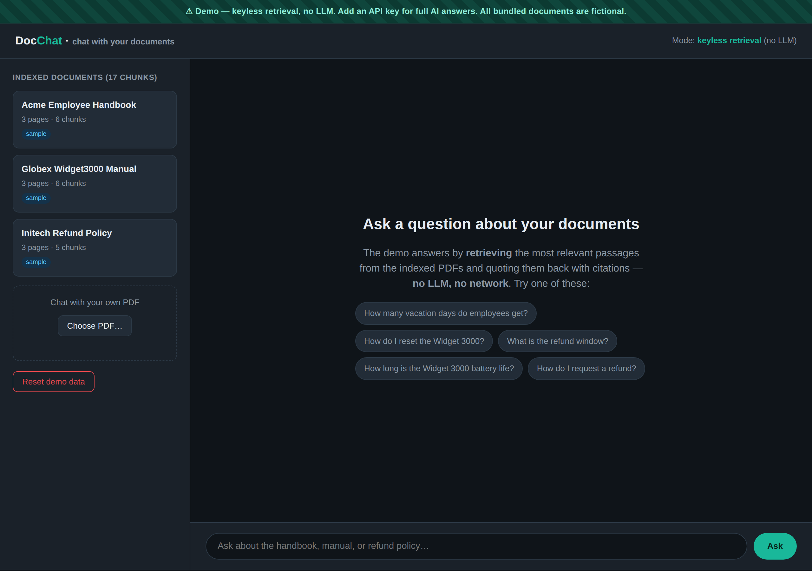
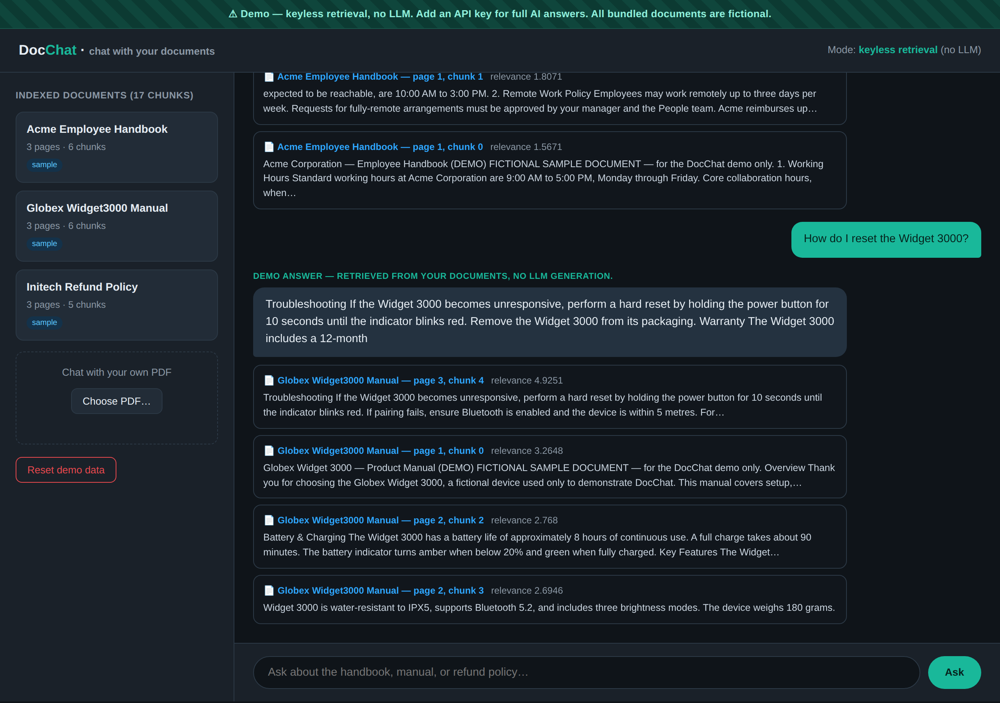

# DocChat — AI Business Tools (chat with your documents)

> A real **retrieval-augmented "chat with your PDFs"** app. It **ingests PDFs** (pypdf), **chunks** them, builds a **pure-Python BM25 index**, and answers a question by **retrieving the most relevant passages and quoting them back with citations** (which document, page and chunk). The demo runs **100% offline with zero config** — no API key, no network, no model downloads — and never pretends an LLM wrote the answer. When you add an LLM API key, the *same* retrieved context powers a natural-language answer instead.

[](https://www.python.org)
[](https://fastapi.tiangolo.com)
[](https://pypdf.readthedocs.io)
[](https://en.wikipedia.org/wiki/Okapi_BM25)
[](./LICENSE)

DocChat proves the **AI Business Tools** service area — specifically **RAG** ("chat with your documents"): the kind of assistant a business points at its handbooks, manuals and policies so staff and customers get instant, **cited** answers. **Every bundled document is fictional** — an Acme employee handbook, a Globex product manual, and an Initech refund policy — with `example.com` emails and `555` phone numbers. A persistent banner makes the keyless, no-LLM nature of the demo explicit.

---

## Screenshots





---

## What it proves

A genuine RAG pipeline, not a mockup:

1. **Real ingestion.** [`ingest.py`](docchat/ingest.py) extracts text from each PDF with **pypdf** and splits it into overlapping word-chunks, keeping each chunk's **source document and page** so answers can cite exactly where they came from.
2. **Real, transparent retrieval.** [`index.py`](docchat/index.py) is a **from-scratch, pure-Python Okapi BM25** index (tokenize → term/document frequencies → IDF → BM25 scoring). No embeddings service, no model download, no network — classic keyword retrieval you can read end to end.
3. **Honest extractive answers.** In the demo, [`rag.py`](docchat/rag.py) takes the top chunks, picks the **best-matching sentences**, and returns them **verbatim** with citations — clearly labelled *“Demo answer — retrieved from your documents, no LLM generation.”* The demo never fabricates prose.
4. **Citations you can trust.** Every answer lists its sources: document name, page, chunk, a relevance score, and the snippet used.
5. **Bring your own PDF.** Upload any PDF in the UI and chat with it immediately — it goes through the *same* keyless ingestion + retrieval.
6. **A real LLM path, off by default.** [`llm.py`](docchat/llm.py) builds a grounded prompt from the retrieved context and calls Anthropic or OpenAI — used **only** when an API key is set. With no key, that code is never touched and the SDKs aren't even required.

## Demo mode vs. the full (LLM) version

| | **Demo (default)** | **Full / LLM** |
| --- | --- | --- |
| Answer | **Extractive** — sentences quoted from your docs | **Generated** — natural language from an LLM |
| Config needed | **None** | `ANTHROPIC_API_KEY` or `OPENAI_API_KEY` |
| Network | None | LLM provider API |
| Retrieval | BM25 (pure Python) | **the same** BM25 |
| Citations | Yes | Yes |

## Tech stack

**Python** · **FastAPI** + **Uvicorn** · **Jinja2** (chat UI) · **pypdf** (PDF text) · **pure-Python BM25** (retrieval) · **SQLite** (document/chunk store). Optional **anthropic** / **openai** for the full version; **reportlab** only to regenerate the sample PDFs.

```
docchat/
├── app.py                      # FastAPI: chat UI + /api/ask + /api/upload
├── docchat/
│   ├── ingest.py               # pypdf text extraction + chunking
│   ├── index.py                # from-scratch BM25 retrieval (pure Python)
│   ├── rag.py                  # retrieve → extractive answer + citations
│   ├── llm.py                  # LLM path (used only if an API key is set)
│   ├── store.py                # SQLite store + in-memory index
│   ├── config.py               # zero-config defaults
│   ├── templates/chat.html
│   └── static/style.css
├── sample_docs/                # 3 bundled, FICTIONAL sample PDFs
├── tools/
│   ├── make_samples.py         # how the sample PDFs were generated (reportlab)
│   ├── smoke.py                # end-to-end ingest + retrieval check
│   └── shoot.py                # screenshot capture (Playwright)
└── docs/screenshots/
```

## Quick start (zero-config demo)

```bash
git clone git@github.com:MoAdelMamoun/docchat.git
cd docchat

python -m venv .venv && source .venv/bin/activate   # Windows: .venv\Scripts\activate
pip install -r requirements.txt

uvicorn app:app --reload      # open http://localhost:8000
```

That's it — no key, no network. The three sample PDFs are ingested on startup. Ask things like *“How many vacation days do employees get?”*, *“How do I reset the Widget 3000?”*, or *“What is the refund window?”* and you'll get a cited, extractive answer. Drop in your own PDF from the sidebar to chat with it.

Sanity-check the pipeline without the web server:

```bash
python tools/smoke.py
```

## Configuration (full / LLM version — optional)

The demo needs nothing. To enable **LLM-generated** answers, copy `.env.example` to `.env` and set one key:

| Variable | Purpose |
| --- | --- |
| `ANTHROPIC_API_KEY` | Use Anthropic for generation (`pip install anthropic`). |
| `OPENAI_API_KEY` | Use OpenAI for generation (`pip install openai`). |
| `DOCCHAT_ANTHROPIC_MODEL` / `DOCCHAT_OPENAI_MODEL` | Optional model overrides. |
| `DOCCHAT_DB_PATH` / `DOCCHAT_UPLOAD_DIR` | Optional storage locations. |

With a key set, the header switches to **full AI** mode: retrieval is unchanged, but the top chunks + your question are sent to the LLM for a natural-language answer — still returned with the same citations.

## REST API

| Method & path | Description |
| --- | --- |
| `POST /api/ask` | Body `{"question": "..."}` → `{answer, mode, label, citations[]}`. |
| `GET /api/documents` | List indexed documents + total chunk count. |
| `GET /api/documents/{id}` | One document's metadata. |
| `POST /api/upload` | Multipart `file=@your.pdf` → ingests and indexes it. |

```bash
curl -X POST http://localhost:8000/api/ask \
  -H 'Content-Type: application/json' -d '{"question":"How do I request a refund?"}'

curl -X POST http://localhost:8000/api/upload -F 'file=@your.pdf'
```

## How the sample PDFs were made

They're committed under [`sample_docs/`](sample_docs/), so the demo needs nothing to run. To regenerate them:

```bash
pip install reportlab
python tools/make_samples.py
```

## Deploy the demo

The demo makes no external calls, so it's safe to host publicly:

- **Any container/VM** — `pip install -r requirements.txt && uvicorn app:app --host 0.0.0.0 --port $PORT`.
- **Fly.io / Render / Railway** — point the start command at `uvicorn app:app`; attach a volume if you want uploaded PDFs to persist.

## Author

Built by **Mohamed Adel Mamoun** — full-stack developer.
🌐 [mohamedadelmamoun.com](https://mohamedadelmamoun.com)

One of a series of open-source portfolio projects, each proving a service area. DocChat proves **AI Business Tools** (chat with your documents / RAG).

## License

[MIT](./LICENSE)
